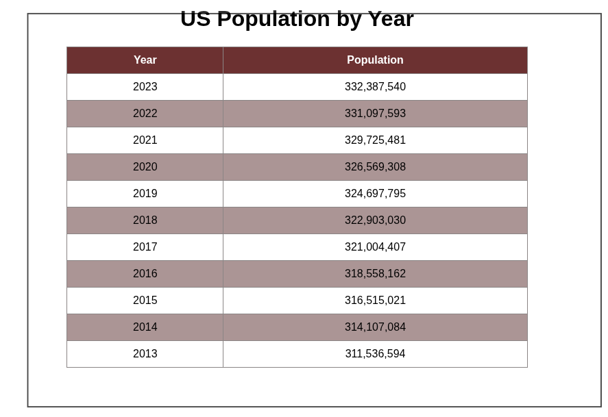

# USPopulation

## HTML
- Using a basic HTMl table element to display data.
```
<table id="populationTable">
    <thead>
        <tr>
            <th>Year</th>
            <th>Population</th>
        </tr>
    </thead>
    <tbody></tbody>
</table> 
```

## JavaScript
- Using XHR to GET data from API endpoint.
- Sorted data from most recent to least.

## CSS
-  Clean, simple, and consistent css styling.
``` 
body {
    font-family: Arial, sans-serif;
    text-align: center;
}

table {
    margin: auto;
    border-collapse: collapse;
    width: 50%;
}

th, td {
    border: 1px solid #8b8686;
    padding: 10px;
}

th {
    background-color: #6c2d2d;
    color: white;
}

tr:nth-child(even) {
    background-color: #ac9696;
}
```
## Final product
